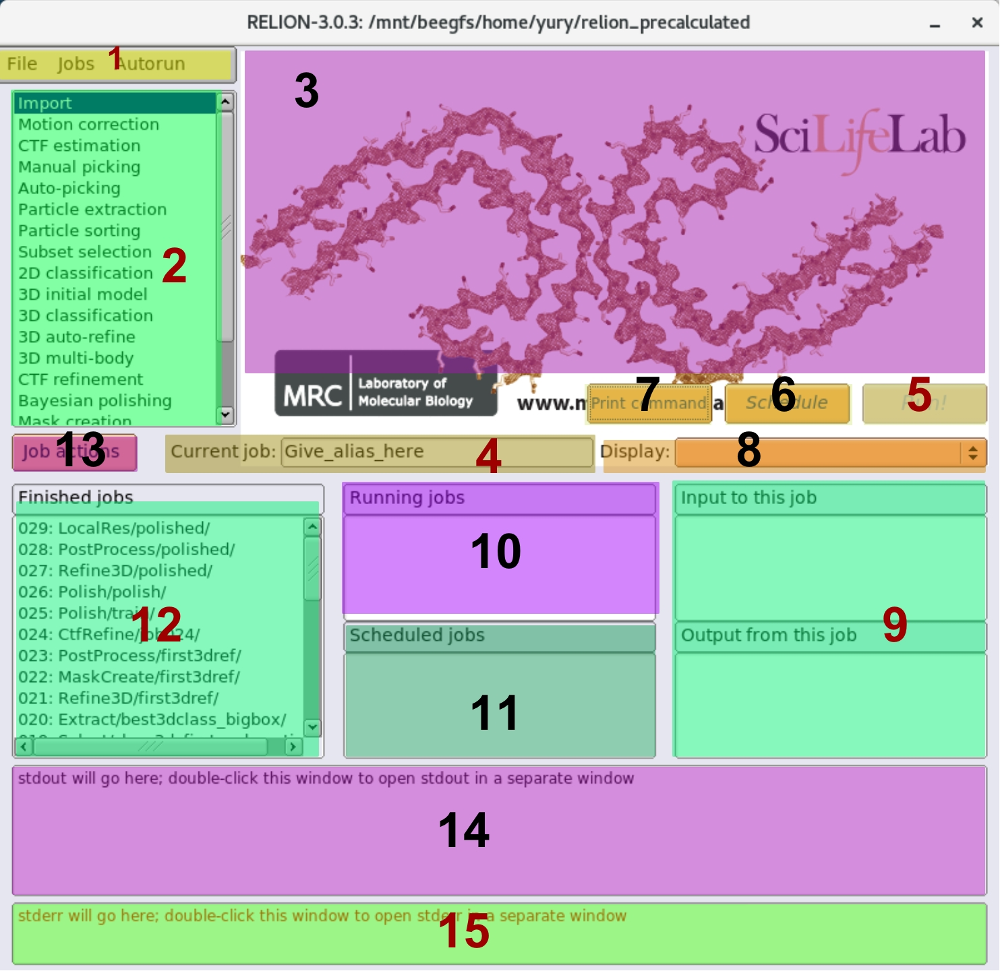

# Run RELION

* [Run RELION via X.org session](#run-relion-via-xorg-session)
* [Run RELION via VNC](#run-relion-via-vnc)
* [Run RELION via VNC in browser](#run-relion-via-vnc-in-browser)
* [RELION GUI](#relion-gui)

RELION provides a set of CLI and desktop applications. But you don't need to learn them all at the first run, because the distribution of RELION goes with the GUI application that wraps all of them. Let’s run it. If you have KVM access to your server - it’s easy. In your Linux desktop environment open the working directory and run RELION from there. Usually, if you run RELION in the current directory for the first time, you can see the new project creation dialog.

```bash
$ cd relion30_tutorial
$ relion
Only run the relion GUI from your ProjectDirectory. Do you want to start a new project here [y/n]?
```
Type "y" and, if everything is okay, you will see the RELION GUI window.

If you are running RELION on the remote server, then you have two options to get remote access.

* Run RELION via X.org session (could be slow)
* Run RELION via VNC (recommended)


## Run RELION via X.org Session

If your local machine running on Linux - skip this step, otherwise you need to install the X Windows System implementation. For example, you can try [XQuartz] for macOS and [Cygwin/X] for Windows.

Open X console and connect to the cluster via SSH with X11 forwarding enabled (-X or -Y)

```bash
ssh yury@10.0.0.1 -X
```

When connection established, `cd` to the working directory and run RELION.

```bash
cd relion30_tutorial
relion
```

The relion window will appear on your local machine's desktop.


## Run RELION via VNC

You need to install a VNC server on your remote server, e.g., `tigervnc-server`. After that, you will be able to run RELION remotely.

To run RELION, connect to the remote server and create a virtual desktop.

```bash
vncserver -geometry 1600x1200 :3

# HINT: check existing sessions
#   $ vncserver -list

# HINT: kill particular sessions
#   $ vncserver -kill :3
```

The `-geometry` parameter sets the desktop resolution; make sure the height of the screen is greater than or equal to `1200` pixels because the RELION GUI window is not scalable and will be cut on the small screen.

The last positional argument `:3` means that we are going to allocate desktop with number `3`, and, according to the default VNC server conventions, the port to connect to this virtual remote desktop will be `5903`. Of course, you can use any number you want instead.

Next, we need to establish an SSH tunnel between the local machine and VNC server port we bound on the remote server.

```bash
ssh -L 5903:10.0.0.1:5903 -N yury@10.0.0.1

# HINT: Additionally, you can specify the `-f` flag to run the corresponding SSH process in the background.
```

Finally, on the local machine, open your VNC client and connect to `localhost:5903`. The Linux desktop will appear.

Now we are ready for the RELION. Open the terminal application in the Linux desktop, switch to the working directory and run relion app.

```bash
cd relion30_tutorial
relion
```

The RELION window will appear on your Linux desktop.


## Run RELION via VNC in Browser

Additionally, you can forward VNC sessions to a browser using [noVNC] server.

Note that noVNC is not a VNC server, it is a “gateway” that forwarding VNC traffic to a web server. That’s why you have to run a VNC server before (see the “Run via VNC” unit).

```sh
./launch.sh \
  --listen 35003 \
  --vnc localhost:5903 \
  --cert /etc/pki/tls/certs/novnc.pem \  # <- Generate it by yourself
  --web /usr/share/novnc
```

Now you can access the remote desktop in your browser on `http://server_address:35003`.


## RELION GUI

As you can see, the RELION window contains a lot of different kinds of controls.



1. RELION control panel. You can perform some global actions from there.
2. Job types selector. Click on specific job type to render job-related form fields for a new job.
3. Job parameters input section (form). Different for each job type.
4. Additional field to specify the alias to a job. If not filled, RELION will set default alias with a number of a job, e.g., `job001`.
5. "Run a job" button.
    * Depending on the job type, once pressed, the "Run" button could turn to the "Continue" button. Use it when you need to resume failed or a stopped job.
6. "Schedule a job" button. It implies that RELION will create a new job with filled parameters, but the job will not be started. You can start it anytime later by selecting it in the scheduled jobs list (11) and pressing the "Run" button (5).
7. Print the current job's console command with entered parameters to the stdout of the terminal where RELION is running.
8. Display tab. Using this dropdown control, you can visually check input and output data of jobs using internal RELION viewer applications.
9. Lists of references for the current job. If you are using output data from other jobs, then these task aliases will be displayed in section "Input to this job". If you set output data of the current job to the input of other jobs - these tasks will be displayed in "Output from this job" section.
10. List of currently running jobs.
11. List of scheduled jobs. You can start all scheduled jobs from the control panel (1): “Autorun” → “Run scheduled jobs”.
12. List of completed tasks.
13. Actions applicable to the current job. For example, change the job alias, mark job as completed, move to trash, etc.
14. stdout of the current task.
15. stderr of the current task.

Follow the next unit to see how to execute jobs with RELION.


-----------------------------------------------------
← [1 Install RELION] | [Top Page] | [3 RELION Jobs] →
-------------------- | ---------- | -----------------


[XQuartz]: https://www.xquartz.org/
[Cygwin/X]: https://x.cygwin.com/
[noVNC]: https://github.com/novnc/noVNC

[1 Install RELION]: ./1%20Install%20RELION.md
[Top Page]: https://github.com/xtreme-d/relion-tutorial-simplified
[3 RELION Jobs]: ./3%20RELION%20Jobs.md
