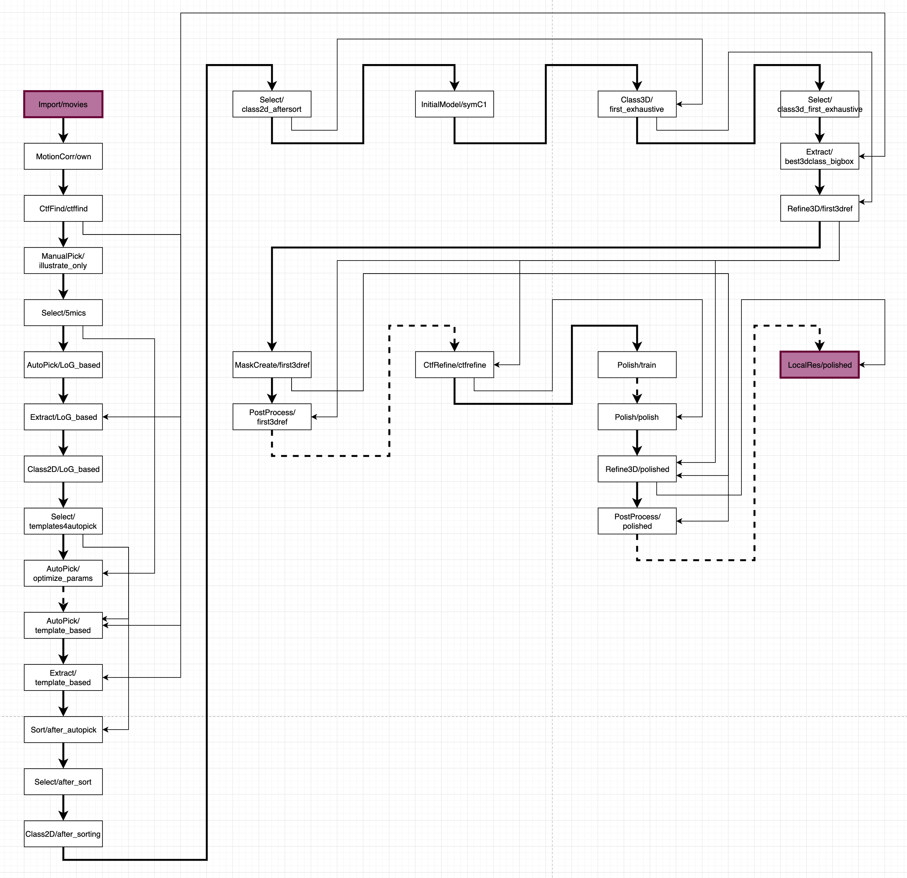

# RELION Tutorial

* [Step description structure](#step-description-structure)
* [MPI](#mpi)

This section describes the relion tutorial jobs workflow: input parameters, explanation, expected results.

The RELION tutorial consists of 29 jobs of various types. To make our simplified tutorial more understandable, we consider each job as an independent step.

The visualization of the tutorial workflow represented below.

* Solid arrows show explicit data interconnectivity between steps. For example, the output data of the arrow's source step is the input data of the arrow's target step.
* Bold solid arrows represents a transition between step chapters.
* Dashed arrows show implicit data interconnectivity between steps. For example, parameters calculated during the arrow's source step become input values for the arrow's target step.
* The first and the last steps marked with the purple color.

## Step description structure

Each step description subunit of this simplified RELION tutorial includes the following parts.

* Navigation block that looks like the example below

Tutorial Unit | 1.2 Beam-induced motion correction
--- | ---
Previous Step | *(1) Import/movies*
　 | *List of jobs that will become an input for the current step. `~` prefix means that relation is implicit.*
Step Alias | **(2) MotionCorr/own**
　 | *The name for the current task (JobType/alias). It is recommended to set this alias to a completed job of the current step*
Next Step | (3) CtfFind/ctffind
　 | *List of jobs that will use the output of the current step as input. `~` prefix means that relation is implicit.*

* Recommended parameters table. It looks like the one below. Note that the parameters are similar to the original RELION tutorial at ~95% and some of them differ.

Field name | Field value
--- | ---
**I/O** | **I/O** (*Name of tab in parameters input section of RELION GUI*)
Input files (*Name of parameter*) | `Movies/*.tiff` (*Value of parameter*)
Node type | 2D micrograph movies [`*.mrcs`, `*.tiff`]

* Explanation text for the step with pictures and screenshots.

Remember that each step represents a single job only. At some steps, you also need to run terminal applications and Chimera as well.

## MPI

Some job types support parallel execution via [message passing interface, or MPI]. The table below describes the relation of each tutorial step to the MPI and how long a particular job running.

 N |  Name                       | Uses MPI | Running time
-- | --------------------------------- | ----- | ---------
 1 | `Import/movies`                   | No    | instantly
 2 | `MotionCorr/own`                  | No    | **fast**
 3 | `CtfFind/ctffind`                 | `Yes` | **fast**
 4 | `ManualPick/illustrate_only`      | No    | instantly
 5 | `Select/5mics`                    | No    | instantly
 6 | `AutoPick/LoG_based`              | `Yes` | **fast**
 7 | `Extract/LoG_based`               | `Yes` | **fast**
 8 | `Class2D/LoG_based`               | `Yes` | *slow*
 9 | `Select/template4autopick`        | No    | instantly
10 | `AutoPick/optimize_params`        | `Yes` | *slow*
11 | `AutoPick/template_based`         | `Yes` | average
12 | `Extract/template_based`          | `Yes` | average
13 | `Sort/after_autopick`             | No    | **fast**
14 | `Select/after_sort`               | No    | instantly
15 | `Class2D/after_sorting`           | `Yes` | *slow*
16 | `Select/class2d_aftersort`        | No    | instantly
17 | `InitialModel/symC1`              | `Yes` | **fast**
18 | `Class3D/first_exhaustive`        | `Yes` | *slow*
19 | `Select/class3d_first_exhaustive` | No    | instantly
20 | `Extract/best3dclass_bigbox`      | `Yes` | average
21 | `Refine/first3dref`               | `Yes` | *slow*
22 | `MaskCreate/first3dref`           | `Yes` | **fast**
23 | `PostProcess/first3dref`          | No    | **fast**
24 | `CtfRefine/ctfrefine`             | `Yes` | **fast**
25 | `Polish/train`                    | No    | *slow*
26 | `Polish/polish`                   | No    | *slow*
27 | `Refine3D/polished`               | `Yes` | *slow*
28 | `PostProcess/polished`            | No    | **fast**
29 | `LocalRes/polished`               | No    | **fast**

Note that:

* The maximum useful number of MPI processes for all jobs that expect micrograph STAR files as input is the number of micrographs in a file, **1 MPI process per micrograph**.
* MPI workflow in the "3D Refine" job type is `1 master` + `2 sets of slaves`, so it is recommended to use an odd number of processes that greater than or equal to `3`.

All the preparations passed now, and we can proceed with the tutorial.

-----------------------------------------------------------
← [3 RELION Jobs] | [Top Page] | [4.1 Prepare Input Data] →
----------------- | ---------- | --------------------------

[message passing interface, or MPI]: https://en.wikipedia.org/wiki/Message_Passing_Interface
[3 RELION Jobs]: ./3%20RELION%20Jobs.md
[Top Page]: https://github.com/xtreme-d/relion-tutorial-simplified
[4.1 Prepare Input Data]: ./4-1%20Prepare%20Input%20Data.md
