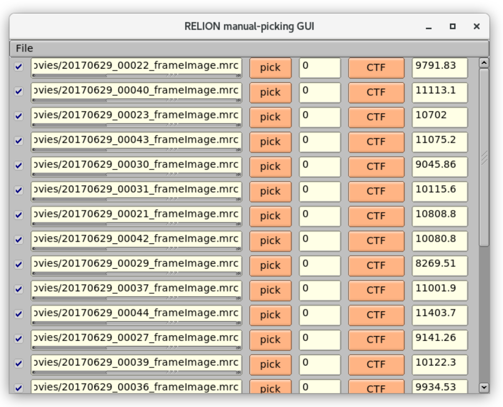
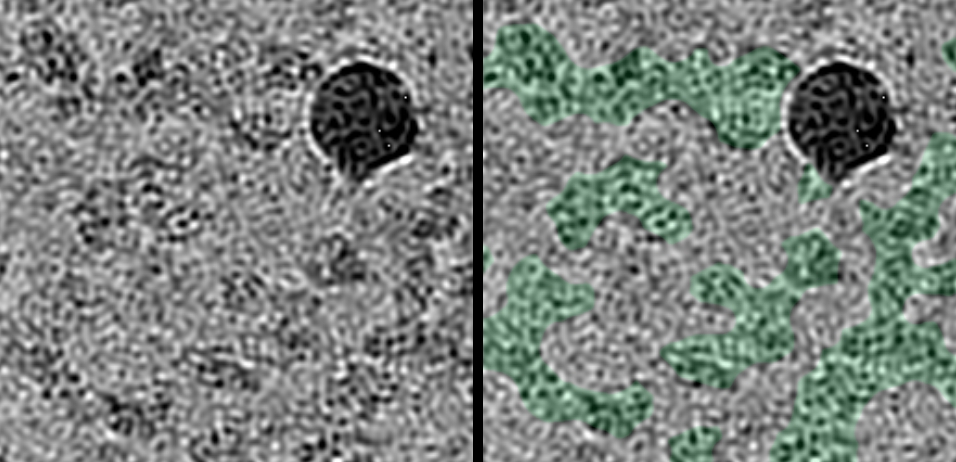
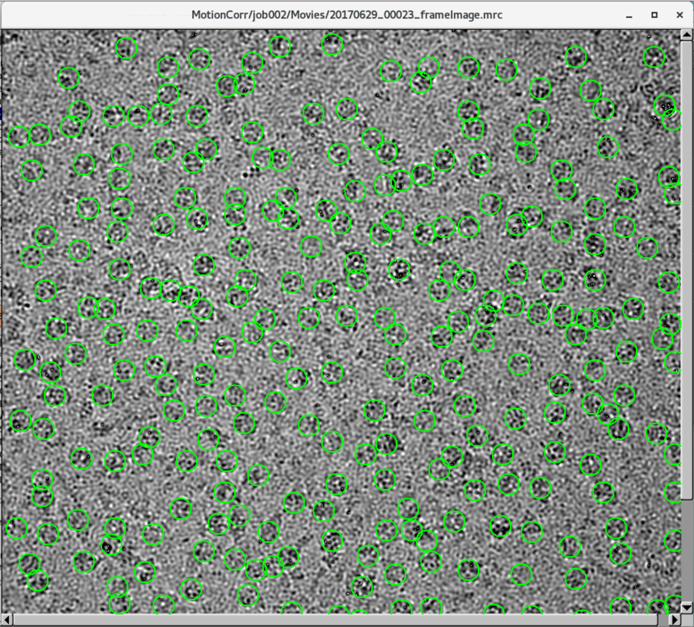
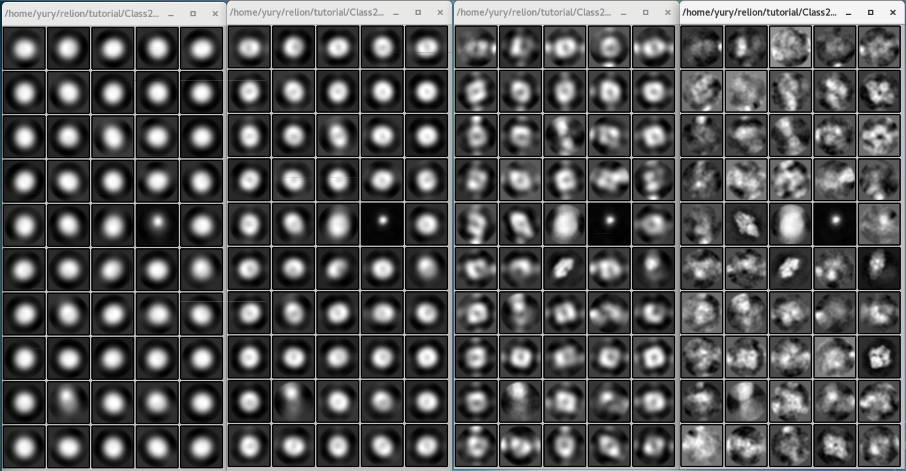
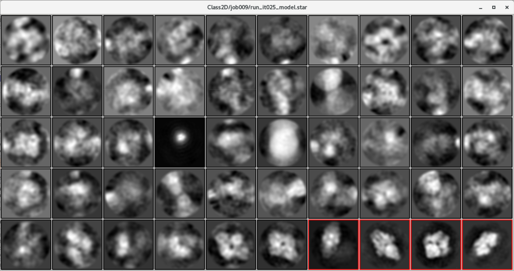

# Laplacian of Gaussian Picking

* [Step 4/29 - Introduction of Manual Picking](#step-429---introduction-of-manual-picking)
* [Step 5/29 - Select the Training Data Set](#step-529---select-the-training-data-set)
* [Step 6/29 - LoG Based Auto-Picking](#step-629---log-based-auto-picking)
* [Step 7/29 - LoG Based Particle Extraction](#step-729---log-based-particle-extraction)
* [Step 8/29 - LoG Based 2D Classification](#step-829---log-based-2d-classification)
* [Step 9/29 - Select Templates for Template Based Auto-Picking](#step-929---select-templates-for-template-based-auto-picking)

Having input data prepared, we can proceed to build a model. In this unit, we are going to pick and apply the classification of particles on several micrographs using the Laplacian of Gaussian (LoG) spatial filter. The purpose of this unit is to create a particle template for full-scale template-based picking that we are going to perform in the next unit.


## Step 4/29 - Introduction of Manual Picking

Tutorial Unit | 1.3 CTF estimation
--- | ---
Previous Step | *(3) CtfFind/ctffind*
Step Alias | **(4) ManualPick/illustrate_only**
Next Step | (5) Select/5mics

On this step, we are going to demonstrate the manual picking feature of RELION. Create a "Manual Picking" job with the parameters in the table below.

Field name | Field value
--- | ---
**I/O** | **I/O**
Input micrographs | `CtfFind/job003/micrographs_ctf.star`
**Display** | **Display**
Particle diameter (A) | `100`
Scale for micrographs | `0.25`
Sigma contrast | `3`
White value | `0`
Blue value | `0`
Lowpass filter (A) | `20`
Highpass filter (A) | `-1`
Pixel size (A) | `-1`
Pick start-end coordinates helices? | `No`
**Colors** | **Colors**
Blue<>red color particles? | `No`

Once you started the job, the window displayed below will appear.



It contains five columns:

* Path to a micrograph file.
* "pick" button, that opens a particle picker application where you can manually pick particles by mouse clicks.
* The number of picked particles.
* "CTF" button that leads to CTF Thon rings image for selected micrograph.
* Each line of controls points on the corresponding micrograph in our data set.
* Defocus rate value, calculated on the previous step.

At this step, you don't need to pick any particles manually, because RELION 3 has the auto-picking feature that we are going to use. This step was included in the tutorial to let the user get experience with the manual-picking interface.

But, before the auto-picking, we need to understand "what" is a particle on the micrograph image. Press the "pick" button of any micrograph, and you will see the micrograph image. The basic rules for manual particle detection are the following:

* A solid grey area is **not a particle**.
* A solid black area is **not a particle**.
* An area with intermixed black and grey dots is **most likely a particle**.



On the picture above, you can see the original micrograph image area on the left, and the same one with "most likely particles" marked with green color in the right.


## Step 5/29 - Select the Training Data Set

Tutorial Unit | 1.4 Manual particle picking
--- | ---
Previous Step | *(4) ManualPick/illustrate_only*
Step Alias | **(5) Select/5mics**
Next Steps | (6) AutoPick/LoG_based
　 | (10) AutoPick/optimize_params

For model training, at initial steps, we need just a few micrographs. Let's select **only first five micrographs** using "Subset selection" job.

Field name | Field value
--- | ---
**I/O** | **I/O**
Select classes from model.star | `-`
OR select from micrographs.star | `-`
OR select from particles.star  | `-`
OR select from picked coords | `ManualPick/job004/coords_suffix_manualpick.star`
**Class options** | **Class options**
Re-center the class averages? | `Yes`
Regroup the particles? | `No`
Approximate nr of groups | `1`
**Subsets** | **Subsets**
Select based on metadata values? | `No`
OR: select on image statistics? | `No`
OR: split into subsets? | `No`
**Duplicates** | **Duplicates**
OR: remove duplicates? | `No`

The "RELION manual-picking GUI" window will appear (same as on the manual picking step).

* Click "File" and "Invert selection."
* Select the **first five micrographs**.
* Again, click "File," and this time, click on "Save selection."


## Step 6/29 - LoG Based Auto-Picking

Tutorial Unit | 1.5 LoG-based auto-picking
--- | ---
Previous Step | *(5) Select/5mics*
Step Alias | **(6) AutoPick/LoG_based**
Next Step | (7) Extract/LoG_based

At this step, we are going to pick an initial set of particles using Laplacian of Gaussian (LoG) spatial filter. It is a [convolution] of two functions well-used in image processing: [Laplacian] and [Gaussian]. Gaussian function decreases noise on an image; the Laplace operator detects particles' edges.

Field name | Field value
--- | ---
**I/O** | **I/O**
Input micrographs for autopick | `Select/job005/micrographs_selected.star`
Pixel size in micrographs (A) | `-1`
2D reference | `-`
OR: provide a 3D reference? | `No`
OR: use Laplacian-of-Gaussian? | `Yes`
**Laplacian** | **Laplacian**
Min. diameter for LoG filter (A) | `150`
Max. diameter for LoG filter (A) | `180`
Are the particles white? | `No`
Maximum resolution to consider (A) | `20`
Adjust default threshold | `0`
**References** | **References**
Lowpass filter references (A) | `20`
Highpass filter (A) | `-1`
Pixel size in references (A) | `-1`
Mask diameter (A) | `-1`
In-plane angular sampling (deg) | `5`
References have inverted contrast? | `Yes`
Are References CTF corrected? | `Yes`
Ignore CTFs until first peak? | `No`
**autopicking** | **autopicking**
Picking threshold | `0.05`
Minimum inter-particle distance (A) | `100`
Maximum stddev noise | `-1`
Minimum avg noise | `-999`
Write FOM maps? | `No`
Read FOM maps? | `No`
Shrink factor | `0`

When job completed, open the `coords_suffix_autopick.star` file via RELION's display field and you can see what regions RELION have picked for each training micrograph.




The auto-picking algorithm is not perfect and false picking, as well as missed particles, also take place. That's why, according to the original RELION manual, it's recommended to check each micrograph and select missed or unselect over-selected picks manually. But, anyway, picking fails doesn't have a significant influence on the resulting model for this tutorial, so you can accept the auto-picking result as it is.


## Step 7/29 - LoG Based Particle Extraction

Tutorial Unit | 1.6 Particle extraction
--- | ---
Previous Steps | *(3) CtfFind/ctffind*
　 | *(6) AutoPick/LoG_based*
Step Alias | **(7) Extract/LoG_based**
Next Step | (8) Class2D/LoG_based

On the previous step, you have performed a particle detection operation against the micrograph, in other words - now you have the coordinates table of particles. On this step, using "Particle extraction" job, we will extract particle images from micrographs by their coordinates.

Field name | Field value
--- | ---
**I/O** | **I/O**
micrograph STAR file | `CtfFind/job003/micrographs_ctf.star`
Input coordinates | `AutoPick/job006/coords_suffix_autopick.star`
OR re-extract refined particles? | `No`
Manually set pixel size? | `No`
**extract** | **extract**
Particle box size (pix) | `256`
Invert contrast? | `Yes`
Normalize particles?  | `Yes`
Diameter background circle (pix) | `200`
Stddev for white dust removal | `-1`
Stddev for black dust removal | `-1`
Rescale particles? | `Yes`
Re-scaled size (pixels) | `64`

When done, you can open `particles.star` file via display field and see the series of cut regions of input micrographs you picked on the previous step.


## Step 8/29 - LoG Based 2D Classification

Tutorial Unit | 1.7 Making templates for auto-picking
--- | ---
Previous Step | *(7) Extract/LoG_based*
Step Alias | **(8) Class2D/LoG_based**
Next Step | (9) Select/templates4autopick

Starting this step, we proceed to create a template for auto-picking particles from the rest of micrographs based on images picked from the "training set" we build so far. First, we apply classification of cut particle images, using [maximum likelihood] estimation.

We are going to use 25 iterations for the classification limited by 50 classes.

Field name | Field value
--- | ---
**I/O** | **I/O**
Input images STAR file | `Extract/job007/particles.star`
**CTF** | **CTF**
Do CTF-correction? | `Yes`
Have data been phase-flipped? | `No`
Ignore CTFs until first peak? | `No`
**Optimization** | **Optimization**
Number of classes | `100`
Regularisation parameter T | `2`
Number of iterations | `25`
Use fast subsets (for large data sets)? | `No`
Mask diameter (A) | `200`
Mask individual particles with zeros? | `Yes`
Limit resolution E-step to (A) | `-1`
**Sampling** | **Sampling**
Perform image alignment? | `Yes`
In-plane angular sampling | `6`
Offset search range (pix) | `5`
Offset search step (pix) | `1`

When job completed, you can check result classes at file `run_it025_model.star` of display field. But more interesting to compare the final result with intermediate iterations. You can visually check how classes looks like on each iteration by `relion_display` command. For example:

```
$ relion_display --i Class2D/LoG_based/run_it001_classes.mrcs &
$ relion_display --i Class2D/LoG_based/run_it003_classes.mrcs &
$ relion_display --i Class2D/LoG_based/run_it007_classes.mrcs &
$ relion_display --i Class2D/LoG_based/run_it025_classes.mrcs &
```



The classification is computational intensive action, and it takes time for running.

**References**

1. [Relion 2D classification (Maximum likelihood)]


## Step 9/29 - Select Templates for Template Based Auto-Picking

Tutorial Unit | 1.8 Selecting templates for auto-picking
--- | ---
Previous Step | *(8) Class2D/LoG_based*
Step Alias | **(9) Select/templates4autopick**
Next Steps | (10) AutoPick/optimise_params
　 | (11) AutoPick/template_based
　 | (13) Sort/after_autopick

As a result of the previous step, we receive a set of particle class images. On the current step, we need to select "good" classes only.

Field name | Field value
--- | ---
**I/O** | **I/O**
Select classes from model.star | `Class2D/job008/run_it025_model.star`
OR select from micrographs.star | `-`
OR select from particles.star  | `-`
OR select from picked coords | `-`
**Class options** | **Class options**
Re-center the class averages? | `Yes`
Regroup the particles? | `No`
Approximate nr of groups | `1`
**Subsets** | **Subsets**
Select based on metadata values? | `No`
OR: select on image statistics? | `No`
OR: split into subsets? | `No`
**Duplicates** | **Duplicates**
OR: remove duplicates? | `No`

* When "Relion display GUI" window appears, check "Sort images on" checkbox, select `rlnClassDistribution`, and press "Display!" button.
* Select "good" class images by clicking on them.
* Press the right mouse button and select "Save selected classes."
* Close Relion display windows.

On the screenshot below, classes that supposed to be a "good" marked with a red frame.



These four classes will be our templates for template-based auto-picking


------------------------------------------------------------------------
← [4.1 Prepare Input Data] | [Top Page] | [4.3 Template Based Picking] →
-------------------------- | ---------- | ------------------------------


[convolution]: https://en.wikipedia.org/wiki/Convolution
[Laplacian]: https://en.wikipedia.org/wiki/Laplace_operator
[Gaussian]: https://en.wikipedia.org/wiki/Gaussian_filter
[maximum likelihood]: https://en.wikipedia.org/wiki/Maximum_likelihood_estimation
[Relion 2D classification (Maximum likelihood)]: https://github.com/cianfrocco-lab/Old-school-processing/wiki/Relion-2D-classification-%28Maximum-likelihood%29
[4.1 Prepare Input Data]: ./4-1%20Prepare%20Input%20Data.md
[Top Page]: https://github.com/xtreme-d/relion-tutorial-simplified
[4.3 Template Based Picking]: ./4-3%20Template%20Based%20Picking.md
