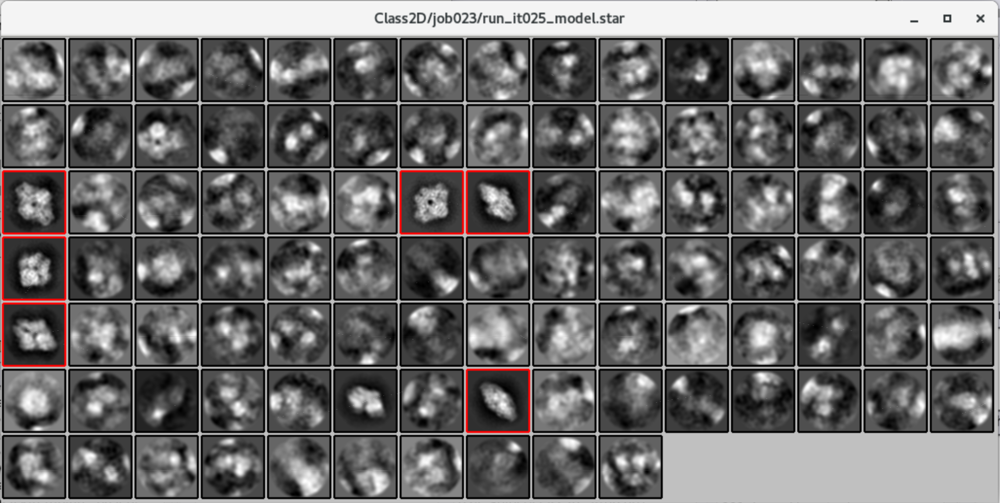

# Template Based Picking

* [Step 10/29 - Optimize Params for Template Based Auto-Picking](#step-1029---optimize-params-for-template-based-auto-picking)
* [Step 11/29 - Template Based Auto-Picking](#step-1129---template-based-auto-picking)
* [Step 12/29 - Template Based Particle Extraction](#step-1229---template-based-particle-extraction)
* [Step 13/29 - Sort Particles Picked by Template Based Auto-Picking](#step-1329---sort-particles-picked-by-template-based-auto-picking)
* [Step 14/29 - Select "Good" Particles After Sorting](#step-1429---select-good-particles-after-sorting)
* [Step 15/29 - 2D Classification of "Good" Particles](#step-1529---2d-classification-of-good-particles)
* [Step 16/29 - Select "Good" Classes](#step-1629---select-good-classes)

During the previous unit of this tutorial, we could get clear and recognizable particle images extracted from a set of few input micrographs. And now, using these images as a template, we will extract more particle images from all micrographs to proceed to 3D model building in the next unit.

## Step 10/29 - Optimize Params for Template Based Auto-Picking

Tutorial Unit | 1.9 Auto-picking
--- | ---
Previous Steps | *(5) Select/5mics*
　 | *(9) Select/templates4autopick*
Step Alias | **(10) AutoPick/optimise_params**
Next Step | ~ (11) AutoPick/template_based

First, we have to optimize picking parameters. The problem is that it would take significant time, but there is a trick. The most expensive part of calculations in the auto-picking jobs is the calculation of the probability-based figure-of-merit (FOM) maps. It represents the cross-correlation coefficient between each template particle image and all selected positions in the micrographs. We can make computations faster if we write FOM on disk and read it on next iterations. You can control FOM related behavior of RELION by using "Write FOM maps?" and "Read FOM maps?" fields.

Here are the parameters that we need to optimize:

* **Picking threshold**. RELION will not include a particular selection if it's FOM value is less than the value of this parameter.
* **Minimum inter-particle distance**. The maximum allowed distance between two neighboring particles.
* **Maximum stddev noise**. It sets the limit for maximum background standard deviation in the normalized micrograph. Useful values are probably in the range `1.0` to `1.2`.
* **Minimum avg noise**. It sets the limit for average background densities. Useful values are probably in the range `-0.5` to `0`.

To get the most optimal parameters, you can follow the algorithm below:

1. Run the "Auto-pick" job with the settings from the table below. Make sure that "Write FOM maps?" set to `Yes` and "Read FOM maps?" set to `No`.
2. Once the job is done, Open "coords_suffix_autopick.star" file from display field and check either picked selections covers the most of particles or not.
3. If you are not good with results:
    1. Select the same job from the finished jobs list.
    2. Set "Write FOM maps?" to `No` and "Read FOM maps?" to `Yes`.
    3. Change one or a few parameters we are going to optimize (listed above) and press the "Continue" button.
    4. Wait until the job is done, recheck results. If it's not okay - repeat step 3.

Field name | Field value
--- | ---
**I/O** | **I/O**
Input micrographs for autopick | `Select/job005/micrographs_selected.star`
Pixel size in micrographs (A) | `-1`
2D reference | `Select/job009/class_averages.star`
OR: provide a 3D reference? | `No`
OR: use Laplacian-of-Gaussian? | `No`
**Laplacian** | **Laplacian**
Min. diameter for LoG filter (A) | `150`
Max. diameter for LoG filter (A) | `180`
Are the particles white? | `No`
Maximum resolution to consider (A) | `20`
Adjust default threshold | `0`
**References** | **References**
Lowpass filter references (A) | `20`
Highpass filter (A) | `-1`
Pixel size in references (A) | `3.54`
Mask diameter (A) | `-1`
In-plane angular sampling (deg) | `5`
References have inverted contrast? | `Yes`
Are References CTF corrected? | `Yes`
Ignore CTFs until first peak? | `No`
**autopicking** | **autopicking**
Picking threshold | `0.8`
Minimum inter-particle distance (A) | `200`
Maximum stddev noise | `-1`
Minimum avg noise | `-999`
Write FOM maps? | `Yes`
Read FOM maps? | `No`
Shrink factor | `0`

In that way, you can play with auto-picking parameters and see how selection changes on different values of parameters. For example, try to change the "picking threshold" from `0.8` to `0.6` or minimum inter-particle distance from `200` to `150`, and you will get more particle selections.

To understand the value of FOM for the particular pick, you can run "Manual Picking" job from the finished jobs list with new "color" tab parameters:

* Blue<>red color particles? - `No`
* MetaDataLabel for color - `rlnAutopickFigureOfMerit`
* STAR file with color label - *Leave empty*
* Blue value - `1`
* Red value - `0`

Running the manual picking job will overwrite default parameters for "RELION display" application. Thus, when you check the results of auto-picking jobs, you could see that picks on micrographs colored by different colors. Red means "very low FOM," blue means "very high FOM."

Once you have found the perfect set of parameters - you can proceed to the next step.

**NOTE**: Initial running with FOM map writing could take much time. It's because writing a FOM map is very expensive for computational resources, and RELION cannot make it in parallel.

## Step 11/29 - Template Based Auto-Picking

Tutorial Unit | 1.9 Auto-picking
--- | ---
Previous Steps | *(3) CtfFind/ctffind*
　 | *(9) Select/templates4autopick*
Step Alias | **(11) AutoPick/template_based**
Next Step | (12) Extract/template_based

Let's pick particles from all micrographs in the same way as we did on the LoG-based auto-picking step. But make sure that you set "Write FOM maps?" and "Read FOM maps?" to `No`.

**NOTE**: according to the tutorial, values for parameters "Picking threshold," "Minimum inter-particle distance," "Maximum stddev noise," and "Minimum avg noise" set to default values in this job, but you should set the values that you experimentally found during the previous step.

Field name | Field value
--- | ---
**I/O** | **I/O**
Input micrographs for autopick | `CtfFind/job003/micrographs_ctf.star`
Pixel size in micrographs (A) | `-1`
2D reference | `Select/job009/class_averages.star`
OR: provide a 3D reference? | `No`
OR: use Laplacian-of-Gaussian? | `No`
**Laplacian** | **Laplacian**
Min. diameter for LoG filter (A) | `150`
Max. diameter for LoG filter (A) | `180`
Are the particles white? | `No`
Maximum resolution to consider (A) | `20`
Adjust default threshold | `0`
**References** | **References**
Lowpass filter references (A) | `20`
Highpass filter (A) | `-1`
Pixel size in references (A) | `3.54`
Mask diameter (A) | `-1`
In-plane angular sampling (deg) | `5`
References have inverted contrast? | `Yes`
Are References CTF corrected? | `Yes`
Ignore CTFs until first peak? | `No`
**autopicking** | **autopicking**
Picking threshold | `0` (or set your value)
Minimum inter-particle distance (A) | `100` (or set your value)
Maximum stddev noise | `-1` (or set your value)
Minimum avg noise | `-999` (or set your value)
Write FOM maps? | `No`
Read FOM maps? | `No`
Shrink factor | `0`

Once done, check `coords_suffix_autopick.star` file and you will see that all micrographs contain selections of particles.

If you are not satisfied with the result, you may manually pick/unpick particular selections.

* Left button click - pick a particle.
* Middle button click - unpick a particle.

Don't forget to save selection from the right mouse button menu ("Save STAR with coordinates")

## Step 12/29 - Template Based Particle Extraction

Tutorial Unit | 1.9 Auto-picking
--- | ---
Previous Steps | *(3) CtfFind/ctffind*
　 | *(11) AutoPick/template_based*
Step Alias | **(12) Extract/template_based**
Next Step | (13) Sort/after_autopick

Once picking is done, we can proceed to particle images extracting. The process is the same as we did with the training set previously.

Field name | Field value
--- | ---
**I/O** | **I/O**
micrograph STAR file | `CtfFind/job003/micrographs_ctf.star`
Input coordinates | `AutoPick/job011/coords_suffix_autopick.star`
OR re-extract refined particles? | `No`
Manually set pixel size? | `No`
**extract** | **extract**
Particle box size (pix) | `256`
Invert contrast? | `Yes`
Normalize particles?  | `Yes`
Diameter background circle (pix) | `200`
Stddev for white dust removal | `-1`
Stddev for black dust removal | `-1`
Rescale particles? | `Yes`
Re-scaled size (pixels) | `64`

All picked particles will be saved in `particles.star` output file in the display field.

## Step 13/29 - Sort Particles Picked by Template Based Auto-Picking

Tutorial Unit | 1.10 Particle sorting
--- | ---
Previous Steps | *(9) Select/templates4autopick*
　 | *(12) Extract/template_based*
Step Alias | **(13) Sort/after_autopick**
Next Step | (14) Select/after_sort

On the previous step, we extracted all picked particles from all micrographs. Now we have to ensure that picked particles are eligible for making a model and remove "bad" particles. We can do it by particle sorting.

Field name | Field value
--- | ---
**I/O** | **I/O**
Input particles to be sorted | `Extract/job012/particles.star`
References from model.star | `-`
OR autopicking references | `Select/job009/class_averages.star`
**Reference** | **Reference**
Pixel size in references (A) | `-1`
Are References CTF corrected? | `Yes`
Ignore CTFs until first peak? | `No`

Run this job, and, once completed, open `particles_sort.star` file from display field. Then, enable the "Sort images on" checkbox field, select `rlnParticleSelectZScore` in the neighbor dropdown field, set "Max nr. images" to `-1` to display all images, and press "Display!".

This job will produce a file called `particles_sort.star` in the output directory, which will be the same as the input file, but with an additional column called `rlnParticleSelectZScore`.

You can see bright images placed above, and dark images placed below. Dark images supposed to be a "bad" particles, so we need to cut them off.

## Step 14/29 - Select "Good" Particles After Sorting

Tutorial Unit | 1.10 Particle sorting
--- | ---
Previous Step | *(13) Sort/after_autopick*
Step Alias | **(14) Select/after_sort**
Next Step | (15) Class2D/after_sorting

Once sorted, we can limit our particles set and select a "good" particles only.

Field name | Field value
--- | ---
**I/O** | **I/O**
Select classes from model.star | `-`
OR select from micrographs.star | `-`
OR select from particles.star | `Sort/job013/particles_sort.star`
OR select from picked coords | `-`
**Class options** | **Class options**
Re-center the class averages? | `Yes`
Regroup the particles? | `No`
**Subsets** | **Subsets**
Select based on metadata values? | `No`
OR: select on image statistics? | `No`
OR: split into subsets? | `No`
**Duplicates** | **Duplicates**
OR: remove duplicates? | `No`

Run the job, set the same parameters for RELION display GUI window, as you did in the previous step, and press "Display." Next, you need to select a border particle between "good" and "bad" particles. Click on it by the right mouse button and then "Select all above." Don't forget to save selection (Right mouse button → "Save STAR with selected images")

## Step 15/29 - 2D Classification of "Good" Particles

Tutorial Unit | 2.1 Reference-free 2D class averaging - Running the job
--- | ---
Previous Step | *(14) Select/after_sort*
Step Alias | **(15) Class2D/after_sorting**
Next Step | (16) Select/class2d_aftersort

Now, we will repeat the classification job against all "good" particles images. This time, set "Number of classes" to `100`.

Field name | Field value
--- | ---
**I/O** | **I/O**
Input images STAR file | `Select/job014/particles.star`
**CTF** | **CTF**
Do CTF-correction? | `Yes`
Have data been phase-flipped? | `No`
Ignore CTFs until first peak? | `No`
**Optimization** | **Optimization**
Number of classes | `100`
Regularisation parameter T | `2`
Number of iterations | `25`
Use fast subsets (for large data sets)? | `No`
Mask diameter (A) | `200`
Mask individual particles with zeros? | `Yes`
Limit resolution E-step to (A) | `-1`
**Sampling** | **Sampling**
Perform image alignment? | `Yes`
In-plane angular sampling | `6`
Offset search range (pix) | `5`
Offset search step (pix) | `1`

When completed, proceed to the next step.

## Step 16/29 - Select "Good" Classes

Tutorial Unit | 2.1 Reference-free 2D class averaging - Running the job
--- | ---
Previous Step | *(15) Class2D/after_sorting*
Step Alias | **(16) Select/class2d_aftersort**
Next Steps | (17) InitialModel/symC1
　 | (18) Class3D/first_exhaustive

During the previous step, we got a set of 2D classes built from all micrographs' particles. Again, let's select "good" (not blurred) classes from results of 2D classification of all particles picked from all input micrographs.

Field name | Field value
--- | ---
**I/O** | **I/O**
Select classes from model.star | `Class2D/job015/run_it025_model.star`
OR select from micrographs.star | `-`
OR select from particles.star | `-`
OR select from picked coords | `-`
**Class options** | **Class options**
Re-center the class averages? | `Yes`
Regroup the particles? | `No`
**Subsets** | **Subsets**
Select based on metadata values? | `No`
OR: select on image statistics? | `No`
OR: split into subsets? | `No`
**Duplicates** | **Duplicates**
OR: remove duplicates? | `No`

Run the job, press the "Display!" button, and select a "good" class images by clicking on them. A class considered as a "good" if:

* it has a dark grey or almost black background;
* it has a bright, detailed sharpen object in the center;
* it doesn't look like "low-resolution ghost."

Check the screenshot below. Classes marked with the red frame is supposed to be a "good" classes.

-----------------------------------------------------------------------------
← [4.2 Laplacian of Gaussian Picking] | [Top Page] | [4.4 Initial 3D model] →
------------------------------------- | ---------- | ------------------------

[4.2 Laplacian of Gaussian Picking]: ./4-2%20Laplacian%20of%20Gaussian%20Picking.md
[Top Page]: https://github.com/xtreme-d/relion-tutorial-simplified
[4.4 Initial 3D Model]: ./4-4%20Initial%203D%20Model.md
