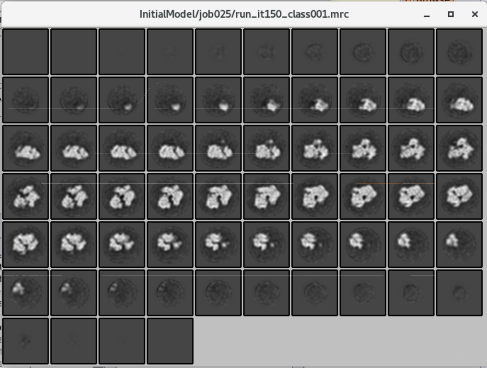
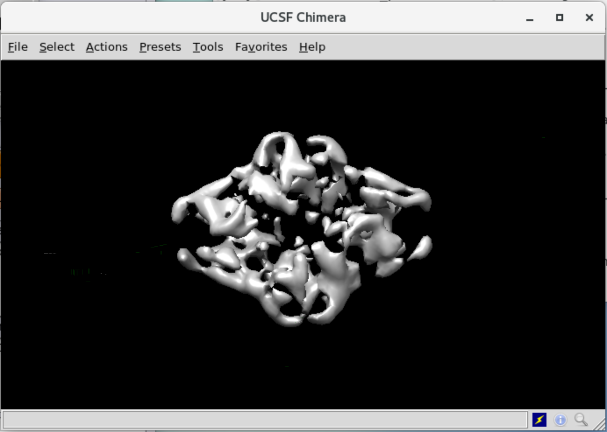
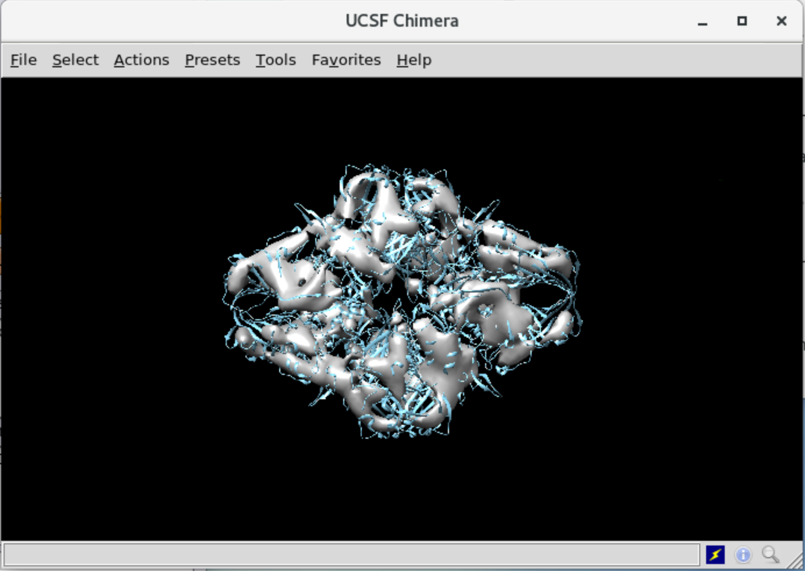
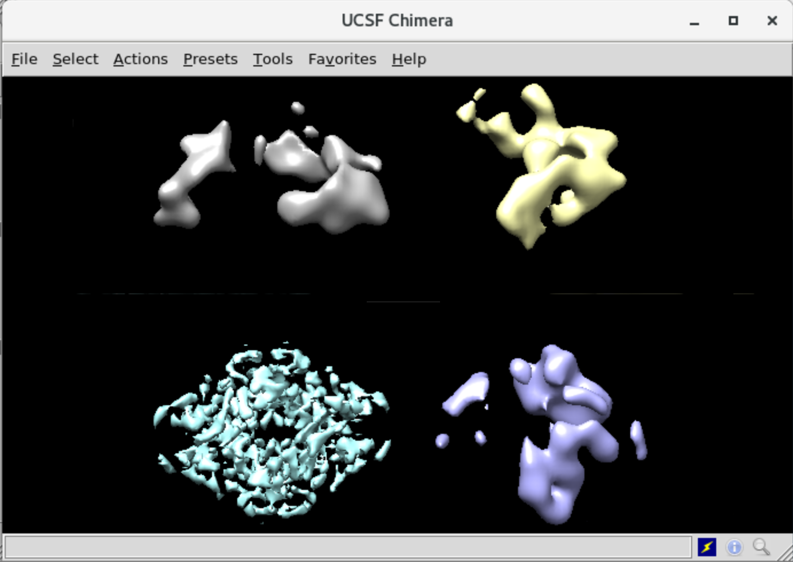

# Initial 3D Model

* [Step 17/29 - Building the Initial 3D Model - Centering Particle](#step-1729---building-the-initial-3d-model---centering-particle)
* [Step 18/29 - 3D Classification - First Exhaustive](#step-1829---3d-classification---first-exhaustive)
* [Step 19/29 - Select Best 3D Class](#step-1929---select-best-3d-class)
* [Step 20/29 - Extract Particles using the Best 3D Class](#step-2029---extract-particles-using-the-best-3d-class)

In this unit, we will build a raw 3D model from a set of 2D images we extracted in the previous unit. It's recommended to use the "UCSF Chimera" application for 3D models viewing.


## Step 17/29 - Building the Initial 3D Model - Centering Particle

Tutorial Unit | 3 De novo 3D model generation
--- | ---
Previous Step | *(16) Select/class2d_aftersort*
Step Alias | **(17) InitialModel/symC1**
Next Step | (18) Class3D/first_exhaustive

Finally, we have enough data to build a 3D model of our particles. On this step, we build an initial 3D model from 2D particle images using [Stochastic Gradient Descent] (SGD) algorithm.

Field name | Field value
--- | ---
**I/O** | **I/O**
Input images STAR file | `Select/job016/particles.star`
**CTF** | **CTF**
Do CTF-correction? | `Yes`
Have data been phase-flipped? | `No`
Ignore CTFs until first peak? | `No`
**Optimization** | **Optimization**
Number of classes | `1`
Mask diameter (A) | `200`
Flatten and enforce non-negative solvent? | `Yes`
Symmetry | `C1`
Initial angular sampling | `15 degrees`
Offset search range (pix) | `6`
Offset search step (pix) | `2`
**SGD** | **SGD**
Number of initial iterations | `25`
Number of in-between iterations | `100`
Number of final iterations | `25`
Write-out frequency (iter) | `10`
Initial resolution (A) | `35`
Final resolution (A) | `15`
Initial mini-batch size | `100`
Final mini-batch size | `500`
SGD increased noise variance half-life | `-1`

Once the job is done, you can check the resulting model. Open file `run_it150_class001.mrc` via display field.



As you can see, our initial 3D model represented as a sequence of slices that doesn't make sense of dimensions. So, let's check the initial model using the "UCSF Chimera" application. You can run it via the terminal.

`"
$ chimera
`"

When Chimera loaded, click the "File" → "Open..." button and open the `run_it150_class001.mrc` file.



Chimera allows observing model from any angle. You can also compare our initial 3D model of a particle with a precise stock model of the same particle.

* Go to "File" → "Fetch by ID."
* Select PDB and input `6DRV` code.
* Press Fetch

The Chimera will download the ideal model and immediately show it on the screen. Then, on the "Volume Viewer" window, open "Tools" → "Fit in Map," Set first line fields like "Fit 6DRV.pdb in map run_it150_class001.mrc" and press "Fit" button.



If both models fit each other - you are on the right way!

When you opened the model for the first time, you could realize that model a bit rotated around the coordinate center. To make future processing simpler, let's fix the symmetry of the model.

First, you need to align the symmetry axes with the main XYZ axes of the coordinate system, according to RELION's conventions. You can achieve this by the following command.

```
relion_align_symmetry \
  --i InitialModel/job017/run_it150_class001.mrc \
  --o InitialModel/job017/run_it150_class001_alignD2.mrc \
  --sym D2
```

You can confirm alignment by opening two models in Chimera simultaneously. After that, we can impose the D2 symmetry.

```
relion_image_handler \
  --i InitialModel/job017/run_it150_class001_alignD2.mrc \
  --o InitialModel/job017/run_it150_class001_symD2.mrc \
  --sym D2
```

## Step 18/29 - 3D Classification - First Exhaustive

Tutorial Unit | 4.1 Running the job
--- | ---
Previous Steps | *(16) Select/class2d_aftersort*
　 | *(17) InitialModel/symC1*
Step Alias | **(18) Class3D/first_exhaustive**
Next Steps | (19) Select/class3d_first_exhaustive
　 | (21) Refine3D/first3dref

Now, we are going to apply a 3D classification using the initial model and 2D particle images. As a result of this action, you will receive 3D classes models.

Field name | Field value
--- | ---
**I/O** | **I/O**
Input images STAR file | `Select/job016/particles.star`
Reference map | `InitialModel/job017/run_it150_class001_symD2.mrc`
Reference mask (optional) | `-`
**Reference** | **Reference**
Ref. map is on absolute greyscale? | `Yes`
Initial low-pass filter (A) | `50`
Symmetry | `C1`
**CTF** | **CTF**
Do CTF-correction? | `Yes`
Has reference been CTF-corrected? | `Yes`
Have data been phase-flipped? | `No`
Ignore CTFs until first peak? | `No`
**Optimization** | **Optimization**
Number of classes | `4`
Regularisation parameter T | `4`
Number of iterations | `25`
Use fast subsets (for large data sets)? | `No`
Mask diameter (A) | `200`
Mask individual particles with zeros? | `Yes`
Limit resolution E-step to (A) | `-1`
**Sampling** | **Sampling**
Perform image alignment? | `Yes`
Angular sampling interval | `7.5 degrees`
Offset search range (pix) | `5`
Offset search step (pix) | `1`
Perform local angular searches? | `No`
Local angular search range | `5`

Once done, let's open all result classes in Chimera to select the best one. You might want to perform the following tunes:

* After you open all classes models, "Tools" → "Volume Data" -> "Fit in Map" and fit all models in the common center.
* Open "Tools" → "Structure Comparison" → "Tile Structures."



In the current case, the best class is the **class #3** (bottom left), but in your case, it may differ. Possibly, you can get more than one good classes.

## Step 19/29 - Select Best 3D Class

Tutorial Unit | 4.1 Running the job
--- | ---
Previous Step | *(18) Class3D/first_exhaustive*
Step Alias | **(19) Select/class3d_first_exhaustive**
Next Step | (20) Extract/best3dclass_bigbox

On the previous step, we decided that the best 3D class is **class #3**. So, run a new "Subset selection" job and make a STAR file with a selection of the best classes as you did many times previously.

Field name | Field value
--- | ---
**I/O** | **I/O**
Select classes from model.star | `Class3D/job018/run_it025_model.star`
OR select from micrographs.star | `-`
OR select from particles.star | `-`
OR select from picked coords | `-`
**Class options** | **Class options**
Re-center the class averages? | `Yes`
Regroup the particles? | `No`
**Subsets** | **Subsets**
Select based on metadata values? | `No`
OR: select on image statistics? | `No`
OR: split into subsets? | `No`
**Duplicates** | **Duplicates**
OR: remove duplicates? | `No`

The result file's name is `particles.star`.


## Step 20/29 - Extract Particles using the Best 3D Class

Tutorial Unit | 5 High-resolution 3D refinement
--- | ---
Previous Steps | *(3) CtfFind/ctffind*
　 | *(19) Select/class3d_first_exhaustive*
Step Alias | **(20) Extract/best3dclass_bigbox**
Next Step | (21) Refine3D/first3dref

Before we proceed high-resolution refinement, let's re-extract particles set with less down-scaling.

Field name | Field value
--- | ---
**I/O** | **I/O**
micrograph STAR file | `CtfFind/job003/micrographs_ctf.star`
Input coordinates | `-`
OR re-extract refined particles? | `Yes`
Refined particles STAR file | `Class3D/job019/particles.star`
Reset the refined offsets to zero? | `No`
OR: re-center refined coordinates? | `No`
Manually set pixel size? | `No`
**extract** | **extract**
Particle box size (pix) | `360`
Invert contrast? | `Yes`
Normalize particles? | `Yes`
Diameter background circle (pix) | `200`
Stddev for white dust removal | `-1`
Stddev for black dust removal | `-1`
Rescale particles? | `Yes`
Re-scaled size (pixels) | `256`

We successfully created a 3D model using 2D pictures of particles. In the next unit, we are going to make it more precise by applying some refinements.


----------------------------------------------------------------------
← [4.3 Template Based Picking] | [Top Page] | [4.5 Refined 3D Model] →
------------------------------ | ---------- | ------------------------


[Stochastic Gradient Descent]: https://en.wikipedia.org/wiki/Stochastic_gradient_descent
[4.3 Template Based Picking]: ./4-3%20Template%20Based%20Picking.md
[Top Page]: https://github.com/xtreme-d/relion-tutorial-simplified
[4.5 Refined 3D Model]: ./4-5%20Refined%203D%20Model.md
