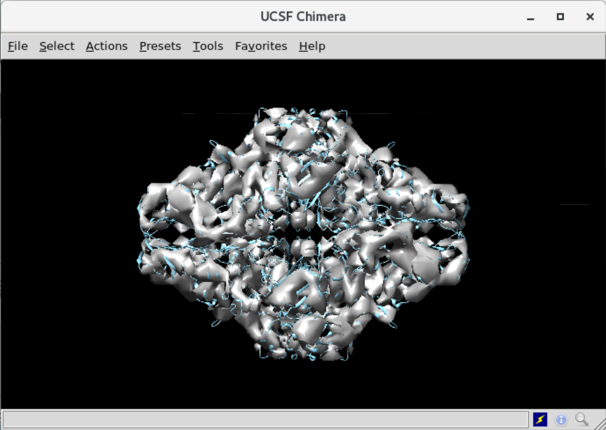
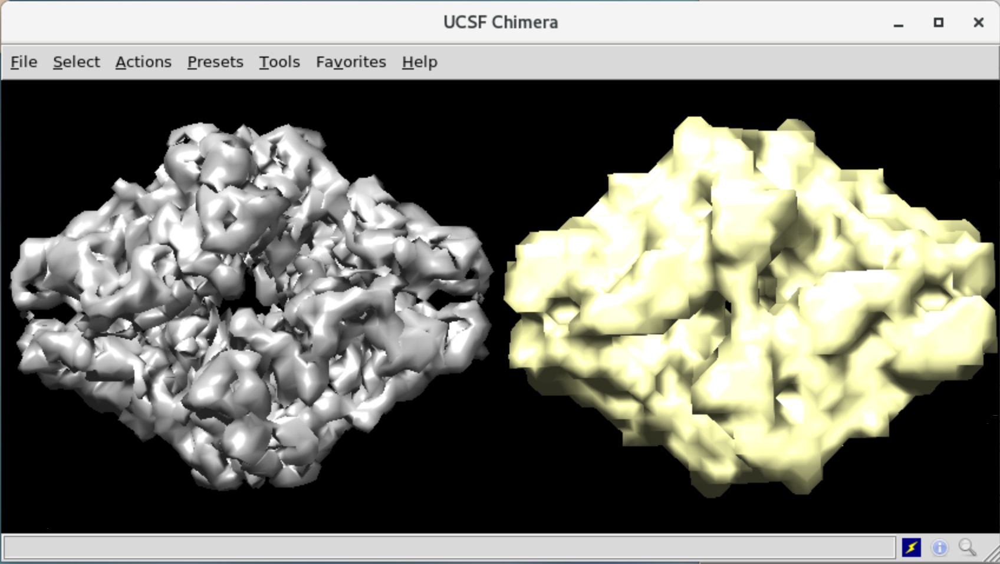
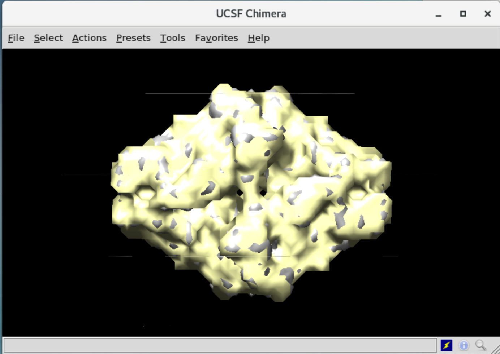
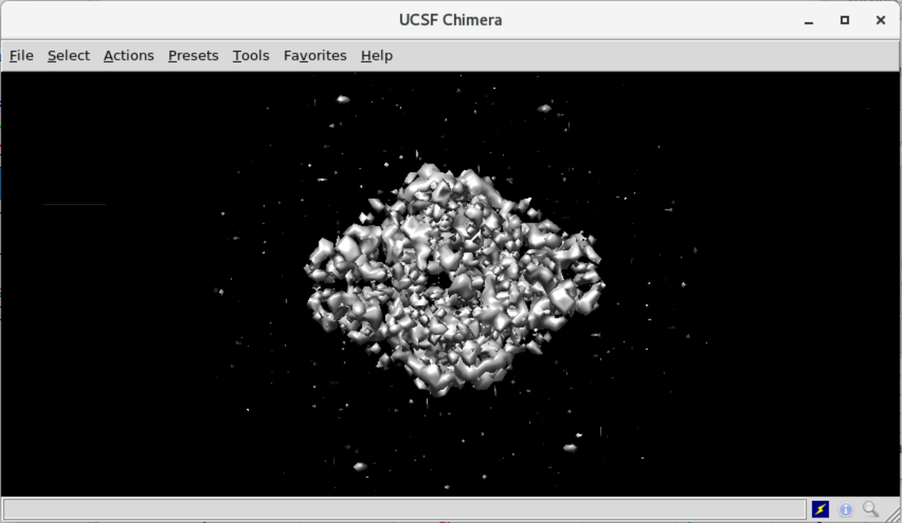
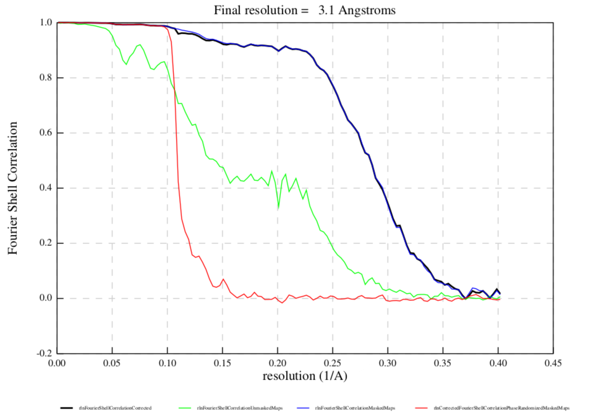
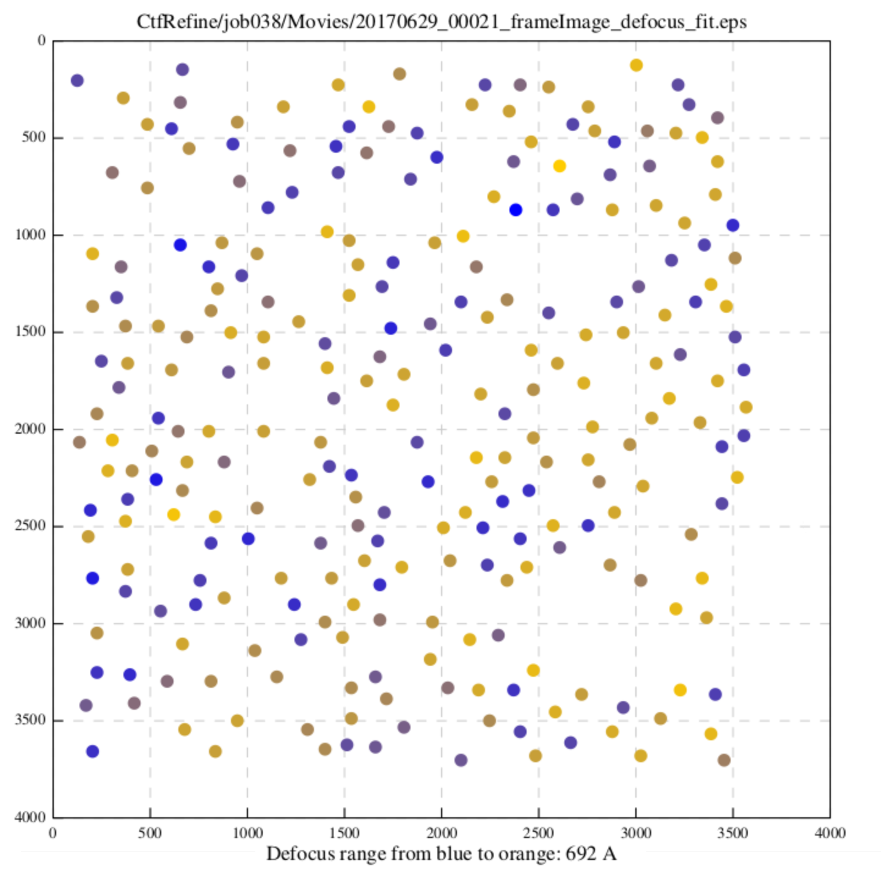

# Refined 3D Model

* [Step 21/29 - Refine 3D Model](#step-2129---refine-3d-model)
* [Step 22/29 - Create a Mask for the Refined Model](#step-2229---create-a-mask-for-the-refined-model)
* [Step 23/29 - Post Processing of the Refined Model](#step-2329---post-processing-of-the-refined-model)
* [Step 24/29 - CTF and Beam Tilt Refinement](#step-2429---ctf-and-beam-tilt-refinement)

In this unit, we will apply refinements to our raw 3D model to make it more precise and useful.


## Step 21/29 - Refine 3D Model

Tutorial Unit | 5.1 Running the auto-refine job
--- | ---
Previous Steps | *(18) Class3D/first_exhaustive*
　 | *(20) Extract/best3dclass_bigbox*
Step Alias | **(21) Refine3D/first3dref**
Next Steps | (22) MaskCreate/first3dref
　 | (23) PostProcess/first3dref
　 | (24) CtfRefine/ctfrefine
　 | (27) Refine3D/polished

Before refining, we need to rescale the best 3D class model to the 256-pixel box size. To do that, execute the following command:

```sh
relion_image_handler \
  --i Class3D/job018/run_it025_class001.mrc \
  --angpix 3.54 \
  --rescale_angpix 1.244 \
  --o Class3D/job018/run_it025_class001_box256.mrc \
  --new_box 256
```

Now, we are ready to perform refinement of the initial 3D model using newly extracted less-downscaled particle images and [gold standard Fourier shell correlation] (FSC) curves.

Field name | Field value
--- | ---
**I/O** | **I/O**
Input images STAR file | `Extract/job020/particles.star`
Reference map | `Class3D/job018/run_it025_class003_box256.mrc`
Reference mask (optional) | `-`
SharpenReference | `SharpenReference`
Ref. map is on absolute greyscale? | `No`
Initial low-pass filter (A) | `50`
Symmetry | `D2`
**CTF** | **CTF**
Do CTF-correction? | `Yes`
Has reference been CTF-corrected? | `Yes`
Have data been phase-flipped? | `No`
Ignore CTFs until first peak? | `No`
**Optimization** | **Optimization**
Mask diameter (A) | `200`
Mask individual particles with zeros? | `Yes`
Use solvent-flattened FSCs? | `No`
**Auto-sampling** | **Auto-sampling**
Initial angular sampling | `7.5 degrees`
Initial offset range (pix) | `5`
Initial offset step (pix) | `1`
Local searches from auto-sampling | `1.8 degrees`

Let's check the results in the Chimera app.



The model looks more detailed now.

**References**

* [Fourier Shell correlation - IMOD / PEET Workshop at RML, June 2017]


## Step 22/29 - Create a Mask for the Refined Model

Tutorial Unit | 6.1 Making a mask
--- | ---
Previous Step | *(21) Refine3D/first3dref*
Step Alias | **(22) MaskCreate/first3dref**
Next Steps | (23) PostProcess/first3dref
　 | (27) Refine3D/polished
　 | (28) PostProcess/polished

After performing a 3D auto-refinement, our model needs to be sharpened. The problem is that the resolution of our model is under-estimated during the 3D refinement step. It's because the noise in the solvent region (not-a-particle region) will lower the FSC curve, so the correctness of the resulting model might be missed.

To resolve this issue, let's create a mask that fully covers model and, in fact, represents a border between a particle and solvent region.

Field name | Field value
--- | ---
**I/O** | **I/O**
Input 3D map | `Refine3D/job021/run_class001.mrc`
**Mask** | **Mask**
Lowpass filter map (A) | `15`
Pixel size (A) | `1.244`
Initial binarisation threshold | `0.005`
Extend binary map this many pixels | `0`
Add a soft-edge of this many pixels | `6`

When completed, let's open the source model and the mask in the Chimera application.



Use the "Fit" feature to make sure that the mask fully covers the model.




## Step 23/29 - Post Processing of the Refined Model

Tutorial Unit | 6.2 Postprocessing
--- | ---
Previous Steps | *(21) Refine3D/first3dref*
　 | *(22) MaskCreate/first3dref*
Step Alias | **(23) PostProcess/first3dref**
Next Step | ~(24) CtfRefine/ctfrefine

Once we have a mask, we are ready to proceed B-factor sharpening and calculating masked FSC curves.

Field name | Field value
--- | ---
**I/O** | **I/O**
One of the 2 unfiltered half-maps | `Refine3D/job021/run_half1_class001_unfil.mrc`
Solvent mask | `MaskCreate/job022/mask.mrc`
Calibrated pixel size (A) | `1.244`
**Sharpen** | **Sharpen**
MTF of the detector (STAR file) | `mtf_k2_300kV.star`
Estimate B-factor automatically? | `Yes`
Lowest resolution for auto-B fit (A) | `10`
Use your own B-factor? | `No`
**Filter** | **Filter**
Skip FSC-weighting? | `No`

As you can see on the sharpened model, it has a noise around the particle's body, but it's okay for now.



Also, it's essential to check the `logfile.pdf` file in the display field of the job. Make sure that FSC curve (red line) showing values more-or-less zero. Otherwise - your mask either too sharp or have many details, and you need to build a new one. It should be built with a stronger lowpass filter (decrease "Lowpass filter map" value) and/or increase "Pixel size" value to make.



**References**

* [High-resolution noise substitution to measure overfitting and validate resolution in 3D structure determination by single particle electron cryomicroscopy.]


## Step 24/29 - CTF and Beam Tilt Refinement

Tutorial Unit | 7 CTF and beamtilt refinement
--- | ---
Previous Steps | *(21) Refine3D/first3dref*
　 | *~(23) PostProcess/first3dref*
Step Alias | **(24) CtfRefine/ctfrefine**
Next Steps | (25) Polish/train
　 | (26) Polish/polish

On this step, we will prepare data for model polishing. For each particle in picked particles data set, we are going to estimate the defocus and beam tilt values. This job type takes the output from 3D refinement and post-processing jobs as an input.

Field name | Field value
--- | ---
**I/O** | **I/O**
Particles (from Refine3D) | `Refine3D/job021/run_data.star`
Postprocess STAR file | `PostProcess/job023/postprocess.star`
**Fit** | **Fit**
Minimum resolution for fits (A) | `30`
Perform CTF parameter fitting? | `Yes`
Fit per-particle defocus? | `Yes`
Range for defocus fit (A) | `2000`
Fit per-micrograph astigmatism? | `No`
Fit per-particle astigmatism? | `No`
Fit per-micrograph phase-shift? | `No`
Perform beamtilt estimation? | `Yes`

Check the output `logfile.pdf` file. It contains a visualization of the estimated defocus value of picked particles for each micrograph. Blue means low defocus, orange means high defocus.



The estimated value of the beam tilt stored in `CtfRefine/job024/beamtilt_0.txt`. It attached to each value in the output `particles_ctf_refine.star` file as well.

The model is almost done; the final stage is polishing.


---------------------------------------------------------
← [4.4 Initial 3D model] | [Top Page] | [4.6 Polishing] →
------------------------ | ---------- | -----------------


[gold standard Fourier shell correlation]: https://en.wikipedia.org/wiki/Fourier_shell_correlation
[Fourier Shell correlation - IMOD / PEET Workshop at RML, June 2017]: http://bio3d.colorado.edu/RML_2017/2017_IMOD_PEET_Workshop/Lectures/FSC.pdf
[High-resolution noise substitution to measure overfitting and validate resolution in 3D structure determination by single particle electron cryomicroscopy.]: https://www.ncbi.nlm.nih.gov/pubmed/23872039
[4.4 Initial 3D model]: ./4-4%20Initial%203D%20Model.md
[Top Page]: https://github.com/xtreme-d/relion-tutorial-simplified
[4.6 Polishing]: ./4-6%20Polishing.md
