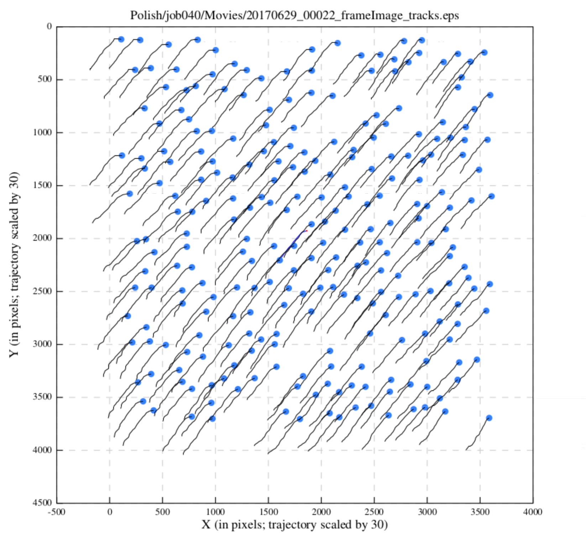
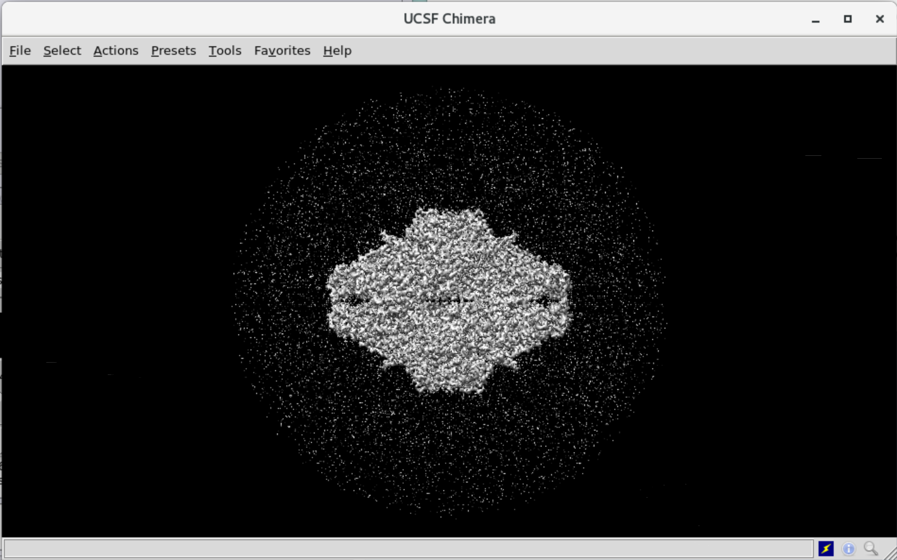
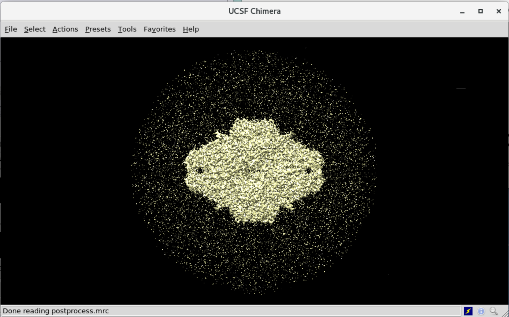
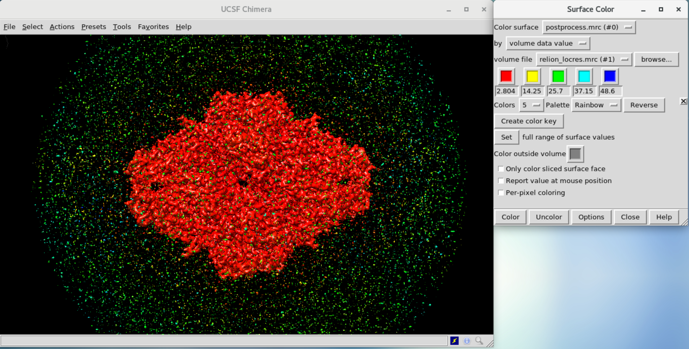

# Polishing

* [Step 25/29 - Train for Polishing](#step-2529---train-for-polishing)
* [Step 26/29 - Polishing](#step-2629---polishing)
* [Step 27/29 - Refine Polished Model](#step-2729---refine-polished-model)
* [Step 28/29 - Post Process of Polished Model](#step-2829---post-process-of-polished-model)
* [Step 29/29 - Local-Resolution Estimation](#step-2929---local-resolution-estimation)

This is the final stage in the simplified tutorial - polishing. Here we will polish our refined model, and it will be ready for the real use in particle detection.

## Step 25/29 - Train for Polishing

Tutorial Unit | 8.1 Bayesian polishing - Running in training mode
--- | ---
Previous Step | *~(2) MotionCorr/own*
　 | *~(23) CtfRefine/ctfrefine*
　 | *(24) CtfRefine/ctfrefine*
Step Alias | **(25) Polish/train**
Next Step | ~(25) Polish/polish

We are going to polish our model with the Bayesian approach to beam-induced motion correction. On this step, we will train optimal params for polishing that will be performed on the next step.

Field name | Field value
--- | ---
**I/O** | **I/O**
Micrographs (from MotionCorr) | `MotionCorr/job002/corrected_micrographs.star`
Particles (from Refine3D or CtfRefine) | `CtfRefine/job024/particles_ctf_refine.star`
Postprocess STAR file | `PostProcess/job023/postprocess.star`
First movie frame | `1`
Last movie frame | `-1`
**Train** | **Train**
Train optimal parameters? | `Yes`
Fraction of Fourier pixels for testing | `0.5`
Use this many particles | `5000`
**Polish** | **Polish**
Perform particle polishing? | `No`

The optimal parameters will be stored in `Polish/train/opt_params.txt` once the job is done.

**Links**

* [A Bayesian approach to beam-induced motion correction in cryo-EM single-particle analysis]

## Step 26/29 - Polishing

Tutorial Unit | 8.2 Bayesian polishing - Running in polishing mode
--- | ---
Previous Steps | *~(2) MotionCorr/own*
　 | *~(23) PostProcess/first3dref*
Step Alias | **(24) CtfRefine/ctfrefine**
Next Steps | ~(25) Polish/train
　 | (26) Polish/polish
　 | (27) Refine3D/polished

Now, we will perform Bayesian polishing with optimal parameters calculated on the previous step.

Field name | Field value
--- | ---
**I/O** | **I/O**
Micrographs (from MotionCorr) | `MotionCorr/job002/corrected_micrographs.star`
Particles (from Refine3D or CtfRefine) | `CtfRefine/job024/particles_ctf_refine.star`
Postprocess STAR file | `PostProcess/job023/postprocess.star`
First movie frame | `1`
Last movie frame | `-1`
**Train** | **Train**
Train optimal parameters? | `No`
**Polish** | **Polish**
Perform particle polishing? | `Yes`
Optimised parameter file | `Polish/job025/opt_params.txt`
OR use your own parameters? | `No`
Minimum resolution for B-factor fit (A) | `20`
Maximum resolution for B-factor fit (A) | `-1`

This job produces `shiny.star` file that contains polished particles.  `logfile.pdf` file includes graphs of the scale and B-factors used for the radiation-damage weighting and visualization of the movement of refined particles for each micrograph.

You can realize that almost all particles on the micrographs moving and have similar traces. To make a correct understanding: consider a point, that represents a particle on the graph, as an initial position of a particle. In other words: all particles move from the top right to bottom left during the movie.

## Step 27/29 - Refine Polished Model

Tutorial Unit | 8.3 Bayesian polishing - Analysing the results
--- | ---
Previous Steps | *(21) Refine3D/first3dref*
　 | *(22) MaskCreate/first3dref*
　 | *(26) Polish/polish*
Step Alias | **(27) Refind3D/polished**
Next Steps | (28) PostProcess/polished
　 | (29) LocalRes/polished

Applying 3D refine to the polished particles.

Field name | Field value
--- | ---
**I/O** | **I/O**
Input images | `Polish/job026/shiny.star`
Reference map | `Refine3D/job021/run_class001.mrc`
Reference mask (optional) | `MaskCreate/job022/mask.mrc`
**Reference** | **Reference**
Ref. map is on absolute greyscale? | `Yes`
Initial low-pass filter (A) | `50`
Symmetry | `D2`
**CTF** | **CTF**
Do CTF-correction? | `Yes`
Has reference been CTF-corrected? | `Yes`
Have data been phase-flipped? | `No`
Ignore CTFs until first peak? | `No`
**Optimization** | **Optimization**
Mask diameter (A) | `200`
Mask individual particles with zeros? | `Yes`
Use solvent-flattened FSCs? | `Yes`
**Auto-sampling** | **Auto-sampling**
Initial angular sampling | `7.5 degrees`
Initial offset range (pix) | `5`
Initial offset step (pix) | `1`
Local searches from auto-sampling | `1.8 degrees`

**HINT**: to make the model more detailed in Chimera - set "Step" value to `1`.

## Step 28/29 - Post Process of Polished Model

Tutorial Unit | 8.3 Bayesian polishing - Analysing the results
--- | ---
Previous Steps | *(22) MaskCreate/first3dref*
　 | *(27) PostProcess/polished*
Step Alias | **(28) PostProcess/polished**

Now we are applying the post-processing to the polished particles.

Field name | Field value
--- | ---
**I/O** | **I/O**
One of the 2 unfiltered half-maps | `Refine3D/job027/run_half1_class001_unfil.mrc`
Solvent mask | `MaskCreate/job022/mask.mrc`
Calibrated pixel size (A) | `1.244`
**Sharpen** | **Sharpen**
MTF of the detector (STAR file) | `mtf_k2_300kV.star`
Estimate B-factor automatically? | `Yes`
Lowest resolution for auto-B fit (A) | `10`
Use your own B-factor? | `No`
**Filter** | **Filter**
Skip FSC-weighting? | `No`

[A Bayesian approach to beam-induced motion correction in cryo-EM single-particle analysis]: https://journals.iucr.org/m/issues/2019/01/00/fq5003/

## Step 29/29 - Local-Resolution Estimation

Tutorial Unit | 9 Local-resolution estimation
--- | ---
Previous Step | *(27) Refine3D/polished*
Step Alias | **(29) LocalRes/polished**

At the final step of the tutorial, we are going to perform the local-resolution estimation. RELION provides the application that can estimate local variations in the resolution of the model what is opposite to global estimate in post-processing. It will help us to differentiate the noise from the final model.

Field name | Field value
--- | ---
**I/O** | **I/O**
One of the 2 unfiltered half-maps | `Refine3D/job027/run_half1_class001_unfil.mrc`
Calibrated pixel size (A) | `1.244`
**ResMap** | **ResMap**
Use ResMap? | `No`
**Relion** | **Relion**
User-provided B-factor | `-100`
MTF of the detector (STAR file) | `mtf_k2_300kV.star`

Let’s open chimera with the following settings.

* Open `Postprocess/polished/postprocess.mrc` file.
* Open “Tools” → “Volume data” → “Surface color”.
* Select coloring by “volume data value” and select `LocalRes/polished/relion_locres.mrc` file and press “Color” button.

You will see that the model became colored in different colors depending on the B-factor value.

Now we can see that the only red part of the final model could be associated with the particle.

There is also the `LocalRes/polished/relion_locres_filtered.mrc` file that contains the locally-filtered and sharpened model, which may be useful to describe the overall variations in model quality in a single model.

The particle model is ready now!

-------------------------------------
← [4.5 Refined 3D Model] | [Top Page]
------------------------ | ----------

[4.5 Refined 3D Model]: ./4-5%20Refined%203D%20Model.md
[Top Page]: https://github.com/xtreme-d/relion-tutorial-simplified
