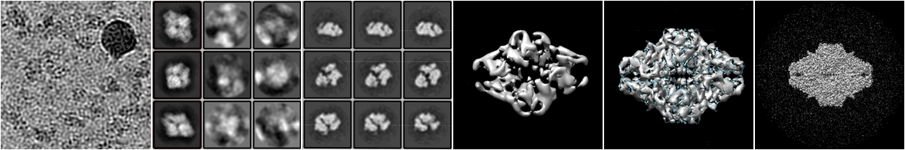

RELION Tutorial Simplified
==========================

This is a simplified version of [the RELION 3.0 tutorial](https://bit.ly/2mgzoQA) for single particle analysis created by Sjors H.W. Scheres. The purpose of this tutorial is to make the RELION workflow clear and understandable for those who have no relations to electronic microscopy but might want to try to get in using RELION.

With RELION, you can build a 3D model of a particle from a set of the 2D micro-photography images (micrographs). It can help to find similar particles on other micrographs faster, and also can boost up further particle research.

The tutorial contains a simplified description of each step of the original tutorial, recommendations about how to get the best results, and explanation of results. Also, it includes links to additional references for cryo-EM terms like beam-induced motion-correction, CTF estimation, Bayesian polishing, and others.

## Table of Contents

* [Install RELION]
    * [Prepare the Environment]
    * [Prepare the Data]
* [Run RELION]
    * [Run RELION via X.org Session]
    * [Run RELION via VNC]
    * [Run RELION via VNC in Browser]
    * [RELION GUI]
* [RELION Jobs]
    * [Job Types]
    * [Job Files]
    * [Job Actions]
    * [Similar Job Parameters]
* [RELION Tutorial]
    * [Prepare Input Data]
        * [Step 1/29 - Create a Pipeline]
        * [Step 2/29 - Motion Correction]
        * [Step 3/29 - CTF Estimation]
    * [Laplacian of Gaussian Picking]
        * [Step 4/29 - Introduction of Manual Picking]
        * [Step 5/29 - Select the Training Data Set]
        * [Step 6/29 - LoG Based Auto-Picking]
        * [Step 7/29 - LoG Based Particle Extraction]
        * [Step 8/29 - LoG Based 2D Classification]
        * [Step 9/29 - Select Templates for Template Based Auto-Picking]
    * [Template Based Picking]
        * [Step 10/29 - Optimize Params for Template Based Auto-Picking]
        * [Step 11/29 - Template Based Auto-Picking]
        * [Step 12/29 - Template Based Particle Extraction]
        * [Step 13/29 - Sort Particles Picked by Template Based Auto-Picking]
        * [Step 14/29 - Select "Good" Particles After Sorting]
        * [Step 15/29 - 2D Classification of "Good" Particles]
        * [Step 16/29 - Select "Good" Classes]
    * [Initial 3D model]
        * [Step 17/29 - Building the Initial 3D Model - Centering Particle]
        * [Step 18/29 - 3D Classification - First Exhaustive]
        * [Step 19/29 - Select Best 3D Class]
        * [Step 20/29 - Extract Particles using the Best 3D Class]
    * [Refined 3D Model]
        * [Step 21/29 - Refine 3D Model]
        * [Step 22/29 - Create a Mask for the Refined Model]
        * [Step 23/29 - Post Processing of the Refined Model]
        * [Step 24/29 - CTF and Beam Tilt Refinement]
    * [Polishing]
        * [Step 25/29 - Train for Polishing]
        * [Step 26/29 - Polishing]
        * [Step 27/29 - Refine Polished Model]
        * [Step 28/29 - Post Process of Polished Model]
        * [Step 29/29 - Local-Resolution Estimation]

[Install RELION]: ./1%20Install%20RELION.md
[Prepare the Environment]: ./1%20Install%20RELION.md#prepare-the-environment
[Prepare the Data]: ./1%20Install%20RELION.md#prepare-the-data

[Run RELION]: ./2%20Run%20RELION.md
[Run RELION via X.org Session]: ./2%20Run%20RELION.md#run-relion-via-xorg-session
[Run RELION via VNC]: ./2%20Run%20RELION.md#run-relion-via-vnc
[Run RELION via VNC in Browser]: ./2%20Run%20RELION.md#run-relion-via-vnc-in-browser
[RELION GUI]: ./2%20Run%20RELION.md#relion-gui

[RELION Jobs]: ./3%20RELION%20Jobs.md
[Job Types]: ./3%20RELION%20Jobs.md#job-types
[Job Files]: ./3%20RELION%20Jobs.md#job-files
[Job Actions]: ./3%20RELION%20Jobs.md#job-actions
[Similar Job Parameters]: ./3%20RELION%20Jobs.md#similar-job-parameters

[RELION Tutorial]: ./4%20RELION%20Tutorial.md

[Prepare Input Data]: ./4-1%20Prepare%20Input%20Data.md
[Step 1/29 - Create a Pipeline]: ./4-1%20Prepare%20Input%20Data.md#step-129---create-a-pipeline
[Step 2/29 - Motion Correction]: ./4-1%20Prepare%20Input%20Data.md#step-229---motion-correction
[Step 3/29 - CTF Estimation]: ./4-1%20Prepare%20Input%20Data.md#step-329---ctf-estimation

[Laplacian of Gaussian Picking]: ./4-2%20Laplacian%20of%20Gaussian%20Picking.md
[Step 4/29 - Introduction of Manual Picking]: ./4-2%20Laplacian%20of%20Gaussian%20Picking.md#step-429---introduction-of-manual-picking
[Step 5/29 - Select the Training Data Set]: ./4-2%20Laplacian%20of%20Gaussian%20Picking.md#step-529---select-the-training-data-set
[Step 6/29 - LoG Based Auto-Picking]: ./4-2%20Laplacian%20of%20Gaussian%20Picking.md#step-629---log-based-auto-picking
[Step 7/29 - LoG Based Particle Extraction]: ./4-2%20Laplacian%20of%20Gaussian%20Picking.md#step-729---log-based-particle-extraction
[Step 8/29 - LoG Based 2D Classification]: ./4-2%20Laplacian%20of%20Gaussian%20Picking.md#step-829---log-based-2d-classification
[Step 9/29 - Select Templates for Template Based Auto-Picking]: ./4-2%20Laplacian%20of%20Gaussian%20Picking.md#step-929---select-templates-for-template-based-auto-picking

[Template Based Picking]: ./4-3%20Template%20Based%20Picking.md
[Step 10/29 - Optimize Params for Template Based Auto-Picking]: ./4-3%20Template%20Based%20Picking.md#step-1029---optimize-params-for-template-based-auto-picking
[Step 11/29 - Template Based Auto-Picking]: ./4-3%20Template%20Based%20Picking.md#step-1129---template-based-auto-picking
[Step 12/29 - Template Based Particle Extraction]: ./4-3%20Template%20Based%20Picking.md#step-1229---template-based-particle-extraction
[Step 13/29 - Sort Particles Picked by Template Based Auto-Picking]: ./4-3%20Template%20Based%20Picking.md#step-1329---sort-particles-picked-by-template-based-auto-picking
[Step 14/29 - Select "Good" Particles After Sorting]: ./4-3%20Template%20Based%20Picking.md#step-1429---select-good-particles-after-sorting
[Step 15/29 - 2D Classification of "Good" Particles]: ./4-3%20Template%20Based%20Picking.md#step-1529---2d-classification-of-good-particles
[Step 16/29 - Select "Good" Classes]: ./4-3%20Template%20Based%20Picking.md#step-1629---select-good-classes

[Initial 3D Model]: ./4-4%20Initial%203D%20Model.md
[Step 17/29 - Building the Initial 3D Model - Centering Particle]: ./4-4%20Initial%203D%20Model.md#step-1729---building-the-initial-3d-model---centering-particle
[Step 18/29 - 3D Classification - First Exhaustive]: ./4-4%20Initial%203D%20Model.md#step-1829---3d-classification---first-exhaustive
[Step 19/29 - Select Best 3D Class]: ./4-4%20Initial%203D%20Model.md#step-1929---select-best-3d-class
[Step 20/29 - Extract Particles using the Best 3D Class]: ./4-4%20Initial%203D%20Model.md#step-2029---extract-particles-using-the-best-3d-class

[Refined 3D Model]: ./4-5%20Refined%203D%20Model.md
[Step 21/29 - Refine 3D Model]: ./4-5%20Refined%203D%20Model.md#step-2129---refine-3d-model
[Step 22/29 - Create a Mask for the Refined Model]: ./4-5%20Refined%203D%20Model.md#step-2229---create-a-mask-for-the-refined-model
[Step 23/29 - Post Processing of the Refined Model]: ./4-5%20Refined%203D%20Model.md#step-2329---post-processing-of-the-refined-model
[Step 24/29 - CTF and Beam Tilt Refinement]: ./4-5%20Refined%203D%20Model.md#step-2429---ctf-and-beam-tilt-refinement

[Polishing]: ./4-6%20Polishing.md
[Step 25/29 - Train for Polishing]: ./4-6%20Polishing.md#step-2529---train-for-polishing
[Step 26/29 - Polishing]: ./4-6%20Polishing.md#step-2629---polishing
[Step 27/29 - Refine Polished Model]: ./4-6%20Polishing.md#step-2729---refine-polished-model
[Step 28/29 - Post Process of Polished Model]: ./4-6%20Polishing.md#step-2829---post-process-of-polished-model
[Step 29/29 - Local-Resolution Estimation]: ./4-6%20Polishing.md#step-2929---local-resolution-estimation
